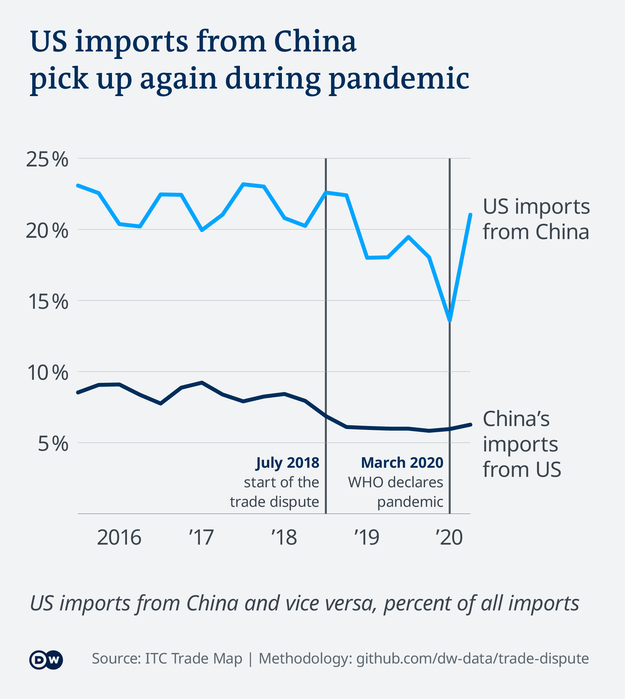
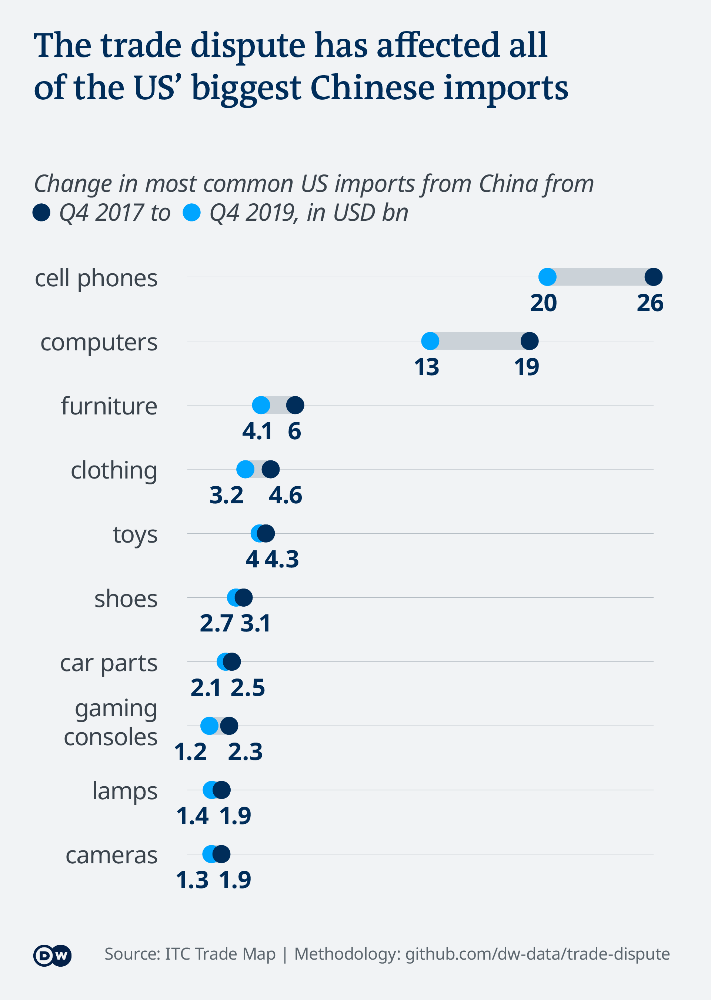
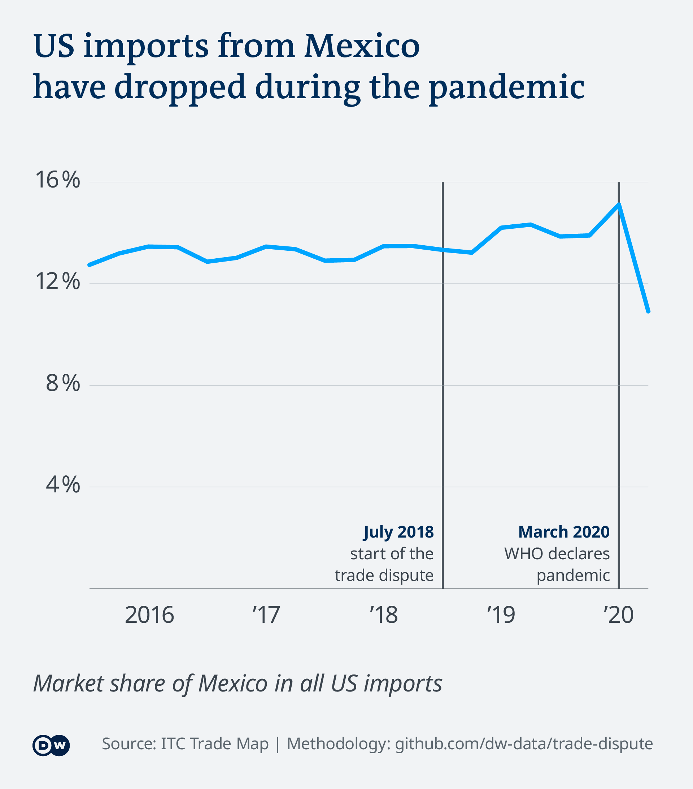
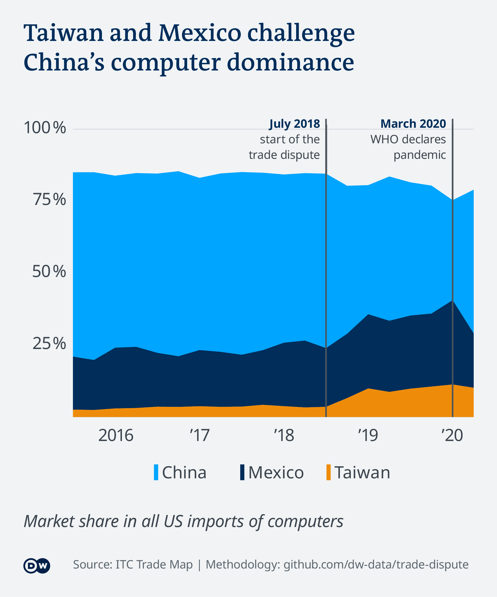

# The real winners of the US-China trade dispute

China and the US have been locked in a trade dispute for more than two
years. With prices for Chinese products rising, where do US consumers
and manufacturers import from instead? This DW analysis shows how global
trade flows have shifted, and how it’s changing the lives of those
affected

*Idea:* Analyze import redirection. If US consumers and manufacturers
have to pay more for Chinese products due to high tariffs, they might
choose to import from alternative countries instead. We analyze which
countries have seen a higher-than-expected rise in US import market
shares, and which specific products have been substituted.

This analysis broadly follows the methodology of the study on US-China
trade diversion from
[Nomura, 2019](https://www.nomuraconnects.com/focused-thinking-posts/us-china-trade-diversion-who-benefits/),
but looking at the timeframe from Q4 2017 (before the start of the trade
dispute) to Q4 2019 (after two years of trade dispute, but before the
Covid-19 pandemic). The analysis then looks at what has changed since
the pandemic started.

*In this repository, you will find the methodology, data and code behind
the stories that came out of this analysis.*

**Read the full stories:**

  - The real winners of the US-China trade dispute:
    [English](https://p.dw.com/p/3kXLJ) |
    [German](https://p.dw.com/p/3kaRJ) |
    [Spanish](https://p.dw.com/p/3kaRJ)
  - How has the trade dispute between the United States and China
    affected Mexico?: [Spanish](https://p.dw.com/p/3kWmN)
  - Video explainer: The real winners (and losers) of the US-China trade
    dispute: [English](https://www.youtube.com/watch?v=J_5u8guvAuI)

**Data analysis by:** [Kira Schacht](https://twitter.com/daten_drang)

**Reporting by:** [Kira Schacht](https://twitter.com/daten_drang),
[Christine Laskowski](https://twitter.com/laskowski_c) and [Luis García
Casas](https://twitter.com/ljgarciac)

# Data sources

For this project, we’ll be using the following datasets:

  - Quarterly imports to the US and China by origin country and product
    (4-digit HS code level), Q3 2015 - Q2 2020, Source: [ITC Trade
    Map](https://www.trademap.org/)
  - Product codes tariffed in the US-China trade dispute, Source:
    [USTR](https://ustr.gov/issue-areas/enforcement/section-301-investigations/search)
  - Country names and corresponding ISO-3 country codes, Source: [World
    Trade
    Organization](https://docs.wto.org/gtd/Default.aspx?pagename=WTOIsocodes&langue=e)
  - Country codes with corresponding regions and continents, source: [UN
    Statistics Division](https://unstats.un.org/unsd/methodology/m49/)
  - GDP by country 2018, Source: [World Bank
    (NY.GDP.MKTP.CD)](https://data.worldbank.org/indicator/NY.GDP.MKTP.CD),
    data for Taiwan from [WTO Trade
    Profile](https://www.wto.org/english/res_e/statis_e/daily_update_e/trade_profiles/TW_e.pdf)

# Analysis

## 0\. Read data

countries included in this analysis:

  - 10 biggest economies per continent by gdp
  - 50 biggest economies globally by gdp
  - excluding Cuba, which didn’t import anything to the US in 2017

| iso.code | country              | continent |    gdp18 |
| :------- | :------------------- | :-------- | -------: |
| DZA      | Algeria              | Africa    |   173.76 |
| AGO      | Angola               | Africa    |   101.35 |
| EGY      | Egypt                | Africa    |   250.89 |
| ETH      | Ethiopia             | Africa    |    84.27 |
| GHA      | Ghana                | Africa    |    65.56 |
| KEN      | Kenya                | Africa    |    87.78 |
| MAR      | Morocco              | Africa    |   117.92 |
| NGA      | Nigeria              | Africa    |   398.16 |
| ZAF      | South Africa         | Africa    |   368.29 |
| TZA      | Tanzania             | Africa    |    58.00 |
| ARG      | Argentina            | Americas  |   519.87 |
| BRA      | Brazil               | Americas  |  1885.48 |
| CAN      | Canada               | Americas  |  1716.26 |
| CHL      | Chile                | Americas  |   298.26 |
| COL      | Colombia             | Americas  |   333.57 |
| CUB      | Cuba                 | Americas  |   100.02 |
| DOM      | Dominican Republic   | Americas  |    85.56 |
| ECU      | Ecuador              | Americas  |   107.56 |
| MEX      | Mexico               | Americas  |  1220.70 |
| PER      | Peru                 | Americas  |   222.04 |
| BGD      | Bangladesh           | Asia      |   274.04 |
| CHN      | China                | Asia      | 13894.82 |
| HKG      | Hong Kong, China     | Asia      |   361.69 |
| IND      | India                | Asia      |  2713.17 |
| IDN      | Indonesia            | Asia      |  1042.24 |
| IRQ      | Iraq                 | Asia      |   224.23 |
| ISR      | Israel               | Asia      |   370.59 |
| JPN      | Japan                | Asia      |  4954.81 |
| KOR      | Korea, Republic of   | Asia      |  1720.58 |
| MYS      | Malaysia             | Asia      |   358.58 |
| PAK      | Pakistan             | Asia      |   314.57 |
| PHL      | Philippines          | Asia      |   346.84 |
| SAU      | Saudi Arabia         | Asia      |   786.52 |
| SGP      | Singapore            | Asia      |   373.22 |
| TWN      | Taipei, Chinese      | Asia      |   589.39 |
| THA      | Thailand             | Asia      |   506.51 |
| TUR      | Turkey               | Asia      |   771.35 |
| ARE      | United Arab Emirates | Asia      |   422.22 |
| VNM      | Viet Nam             | Asia      |   245.21 |
| AUT      | Austria              | Europe    |   455.51 |
| BEL      | Belgium              | Europe    |   542.69 |
| CZE      | Czech Republic       | Europe    |   244.99 |
| DNK      | Denmark              | Europe    |   355.68 |
| FIN      | Finland              | Europe    |   275.89 |
| FRA      | France               | Europe    |  2787.86 |
| DEU      | Germany              | Europe    |  3949.55 |
| GRC      | Greece               | Europe    |   218.14 |
| IRL      | Ireland              | Europe    |   382.67 |
| ITA      | Italy                | Europe    |  2085.76 |
| NLD      | Netherlands          | Europe    |   914.10 |
| NOR      | Norway               | Europe    |   434.17 |
| POL      | Poland               | Europe    |   587.11 |
| PRT      | Portugal             | Europe    |   241.27 |
| ROU      | Romania              | Europe    |   241.63 |
| RUS      | Russian Federation   | Europe    |  1669.58 |
| ESP      | Spain                | Europe    |  1419.74 |
| SWE      | Sweden               | Europe    |   555.46 |
| CHE      | Switzerland          | Europe    |   705.14 |
| GBR      | United Kingdom       | Europe    |  2860.67 |
| AUS      | Australia            | Oceania   |  1433.90 |
| FJI      | Fiji                 | Oceania   |     5.54 |
| NZL      | New Zealand          | Oceania   |   207.92 |
| PNG      | Papua New Guinea     | Oceania   |    23.41 |
| WSM      | Samoa                | Oceania   |     0.82 |
| SLB      | Solomon Islands      | Oceania   |     1.40 |
| TON      | Tonga                | Oceania   |     0.45 |
| VUT      | Vanuatu              | Oceania   |     0.91 |

Dataset overview:

`d_usa` imports to the USA from the 50 biggest economies (GDP) plus
Taiwan, by:

  - `p.code`: product codes (HS4)
  - `quarter`: quarter (Q3 2015 - Q2 2020)
  - `country`: import country
  - `value`: value in thousand USD

`d_usa_total` total imports to the USA by:

  - `p.code`: product code (HS4)
  - `quarter`: quarter (Q3 2015 - Q2 2020)
  - `value`: value in thousand USD

Equivalent for `d_china_total` and `d_china`.

`p` list of 4-digit product codes and descriptions:

  - `p.code`: product code (HS4)
  - `p.label`: official product description (HS4)
  - `p.code.clean`: consolidated product codes for use with this
    analysis
  - `short.name`: short product labels for use with this analysis

For this analysis, we have merged some product codes and given labels
where appropriate. A list of all labels and groupings can be found in
the file `product_names.tsv`.

`t` list of tariffed products by

  - `HTS_id`: product code (HS4)
  - `a_vol`: volume of the corresponding tariff action(s)
  - `a_name`: label of the corresponding tariff action(s) (Lists 1
    through 4)

`gdp` GDP 2018 by country, region and continent

## 1\. Overview of trade between US and China

### 1.1 How has trade between the US and China changed?

#### Total US import volume over time

<!-- -->

The total US trade volume decreased during the trade dispute, and even
more during the pandemic.

#### US imports from China vs China’s imports from the US

**in USD**
<!-- -->

**in percent (market share)**

#### Decrease between 2017 and 2019

In 2017, the US imported products worth USD 0 bn from China. That was
around % of all US imports. By Q4 2019, China provided only % of US
imports. With the 2017 figures as a baseline, this decrease of % equals
a loss of around USD bn per year.

### 1.2 Who are the main importers to the US?

<!-- -->

### 1.3 What are the main US imports from China?

<!-- -->

### 1.4 What share of Chinese products is tariffed?

for Q4
2019:

| tariff        |    Number of categories |                  Import value |
| :------------ | ----------------------: | ----------------------------: |
| Tariffed      |                    0.95 |                          0.93 |
| Untariffed    |                    0.05 |                          0.07 |
| 95% of produc | ts and 93% of US import | value are subject to tariffs. |

## 2\. Change during Covid

### 2.1 Which product imports from China have risen the most from Q4 2019 to Q2 2020?

| p.code | short.name                               | 2019-Q4 | 2020-Q2 |   change |
| :----- | :--------------------------------------- | ------: | ------: | -------: |
| 6307   | textiles incl. face masks                |  833817 | 8058771 | 9.664916 |
| 6210   | textiles including PPE                   |  234748 | 1603510 | 6.830772 |
| 8415   | air conditioners                         |  269501 |  885547 | 3.285877 |
| 2936   | vitamins                                 |  142888 |  308208 | 2.156990 |
| 8424   | spray machines (e.g. fire extinguishers) |  228514 |  442546 | 1.936625 |
| 9018   | medical instruments                      |  450047 |  819861 | 1.821723 |
| 7321   | stoves                                   |  412257 |  743674 | 1.803909 |
| 8414   | air pumps                                |  643019 | 1017658 | 1.582625 |
| 3926   | plastics incl. face shields              | 1373511 | 2031869 | 1.479325 |
| 8433   | agricultural machines                    |  129775 |  188321 | 1.451135 |

Many medical products have skyrocketed. The category of textiles that
includes face masks has increased almost ten-fold between Q4 2019 and Q2
2020.

### .2 Which product imports overall have risen the most from Q4 2019 to Q2 2020?

| p.code | short.name                       | 2019-Q4 |  2020-Q2 |        change |
| :----- | :------------------------------- | ------: | -------: | ------------: |
| 7115   | things made from precious metals |  781622 | 13618333 |     17.423170 |
| 6307   | textiles incl. face masks        | 1225652 |  8938914 |      7.293191 |
| 7108   | gold                             | 3495674 | 18966629 |      5.425743 |
| 6210   | textiles including PPE           |  441978 |  2013990 |      4.556765 |
| 0806   | grapes                           |  164892 |   658832 |      3.995537 |
| 3808   | insecticide                      |  216429 |   607370 |      2.806325 |
| 3003   | medicaments                      |  106196 |   285867 |      2.691881 |
| 9025   | thermometers o.<c3><a4>.         |      21 |  9135 58 | 1057 2.651594 |
| 2932   | chemicals                        |  361826 |   872049 |      2.410134 |
| 7118   | coins                            |  246449 |   551113 |      2.236215 |

Some medical products, others seem to be seasonal.

## 3\. Trade redirection effects

To estimate the effect of trade redirection on different products, we’ll
look at how the market share of different countries in each product has
changed over time. We would expect that in products affected by tariffs,
China’s market share would drop, and other countries’ market shares
would rise instead.

The percentage point difference in market share of country c in the
import market for product p is described as:

or:

    (US imports of product p from country c in Q4 2019/US imports of product p in Q4 2019) -
    (US imports of product p from country c in Q4 2017/US imports of product p in Q4 2017) =
    
    US import market share of country c in product p in Q4 2019 -
    US import market share of country c in product p in Q4 2017

### 3.1 Estimate the loss of China’s market share in US imports

Which products have seen the largest drop in China’s market share within
US imports?

**China’s average market share decline in tariffed vs non-tariffed
products:**

| tariff     |  change |
| :--------- | ------: |
| Tariffed   | \-0.034 |
| Untariffed | \-0.007 |

Imports of tariffed products fell by 3.4 percentage points on average,
while non-tariffed items fell by only 0.7 percentage points.

**Which imports to the US have been affected by import substitution away
from China?**

i.e. for which products has China’s market share dropped more than that
of non-tariffed products between Q4 2017 and Q4 2019?

| subs  |   n | value\_19Q4 | Number of categories | Import value |
| :---- | --: | ----------: | -------------------: | -----------: |
| FALSE | 499 |       17.01 |                 0.43 |         0.16 |
| TRUE  | 654 |       89.66 |                 0.57 |         0.84 |

Indication of import substitution can be found in 654 tariffed product
categories (57% of all product categories), making up 84% of tariffed US
import value in Q4 2019 (USD 89 bn).

Next, we calculate the *change in imports* for 654 tariffed products
with indication of import substitution. This is expressed as:

    change in imports of prouct p from country c =
        change in country c's share in US imports of product p * total US import value in Q4 2019

with the change in country c’s share in US imports of product p defined
as:

    (US imports of product p from country c in Q4 2019/US imports of product p in Q4 2019) -
    (US imports of product p from country c in Q4 2017/US imports of product p in Q4 2017) =
    
    US import market share of country c in product p in Q4 2019 -
    US import market share of country c in product p in Q4 2017

**Which products are most heavily impacted by the tariffs?**

Filter for products imported by China with the highest loss in
imports.

| p.code.clean | short.name            | 2017-Q4 | 2019-Q4 | change | change.imports.bn | value\_17Q4 | value\_19Q4 |
| :----------- | :-------------------- | ------: | ------: | -----: | ----------------: | ----------: | ----------: |
| 847X         | computers             |    0.62 |    0.44 | \-0.17 |            \-5.18 |       30.56 |       30.10 |
| 940X         | furniture             |    0.47 |    0.33 | \-0.14 |            \-1.72 |       12.73 |       12.39 |
| 8517         | cell phones           |    0.71 |    0.66 | \-0.05 |            \-1.54 |       36.00 |       29.97 |
| 6XXX         | clothing              |    0.34 |    0.25 | \-0.09 |            \-1.18 |       13.44 |       12.81 |
| 8523         | storage media         |    0.41 |    0.07 | \-0.34 |            \-1.09 |        3.09 |        3.18 |
| 4202         | bags                  |    0.55 |    0.33 | \-0.22 |            \-0.60 |        2.86 |        2.72 |
| 8528         | monitors              |    0.47 |    0.37 | \-0.10 |            \-0.59 |        7.48 |        6.09 |
| 8541         | NA                    |    0.23 |    0.08 | \-0.15 |            \-0.53 |        3.75 |        3.49 |
| 64XX         | shoes                 |    0.52 |    0.44 | \-0.08 |            \-0.49 |        5.94 |        6.07 |
| 8504         | electrical converters |    0.42 |    0.30 | \-0.12 |            \-0.48 |        3.64 |        4.02 |

Exports of computers, furniture and cell phones from China to the US
have been most heavily affected by the tariffs. For example, China used
to provide 62% of imported US computers. In Q4 2019, it only provided
44%. That corresponds to a loss of around USD5bn over the two years of
the trade dispute.

### 3.2 Estimate additional imports to ths US from third party countries

Filter for products with the most additional
imports:

| country            | p.code.clean | short.name                       | 2017-Q4 | 2019-Q4 | change | change.imports.bn | value\_17Q4 | value\_19Q4 |
| :----------------- | :----------- | :------------------------------- | ------: | ------: | -----: | ----------------: | ----------: | ----------: |
| Viet Nam           | 8517         | cell phones                      |    0.04 |    0.10 |   0.07 |              1.97 |       36.00 |       29.97 |
| Mexico             | 847X         | computers                        |    0.19 |    0.25 |   0.06 |              1.93 |       30.56 |       30.10 |
| Taipei, Chinese    | 847X         | computers                        |    0.04 |    0.11 |   0.06 |              1.91 |       30.56 |       30.10 |
| Russian Federation | 2710         | petroleum                        |    0.15 |    0.22 |   0.07 |              1.03 |       12.09 |       14.94 |
| Viet Nam           | 940X         | furniture                        |    0.11 |    0.19 |   0.08 |              1.02 |       12.73 |       12.39 |
| Malaysia           | 8542         | electronic circuits              |    0.41 |    0.51 |   0.11 |              0.96 |        8.73 |        9.03 |
| Ireland            | 2934         | chemicals                        |    0.18 |    0.52 |   0.34 |              0.62 |        1.21 |        1.81 |
| Korea, Republic of | 2710         | petroleum                        |    0.05 |    0.08 |   0.04 |              0.55 |       12.09 |       14.94 |
| Mexico             | 8528         | monitors                         |    0.43 |    0.51 |   0.08 |              0.52 |        7.48 |        6.09 |
| Canada             | 7115         | things made from precious metals |    0.19 |    0.84 |   0.65 |              0.51 |        0.17 |        0.78 |

Cell phones from Vietnam, computers from Mexico and Taiwan have gained
the most.

#### sum by product

| p.code.clean | short.name            | change.imports.bn |
| :----------- | :-------------------- | ----------------: |
| 847X         | computers             |              5.19 |
| 940X         | furniture             |              1.67 |
| 8517         | cell phones           |              1.50 |
| 8523         | storage media         |              1.11 |
| 2710         | petroleum             |              1.00 |
| 6XXX         | clothing              |              0.81 |
| 8528         | monitors              |              0.59 |
| 8541         | NA                    |              0.50 |
| 8504         | electrical converters |              0.47 |
| 64XX         | shoes                 |              0.43 |
| 8544         | cables                |              0.43 |
| 8443         | printers              |              0.41 |
| 8542         | electronic circuits   |              0.38 |
| 8525         | cameras               |              0.38 |
| 4202         | bags                  |              0.35 |
| 9504         | gaming consoles       |              0.34 |
| 4011         | NA                    |              0.32 |
| 9404         | bedding               |              0.31 |
| 8708         | car parts             |              0.31 |
| 6810         | NA                    |              0.25 |

Computers/computer parts (USD 5bn), furniture (USD 1.7bn) and cell
phones (USD 1.5bn) have gained the most overall.

#### sum by country

| country            | change.imports.bn |
| :----------------- | ----------------: |
| Viet Nam           |              6.43 |
| Mexico             |              4.66 |
| Taipei, Chinese    |              3.17 |
| Malaysia           |              1.74 |
| India              |              1.64 |
| Korea, Republic of |              1.60 |
| Russian Federation |              1.21 |
| Thailand           |              1.04 |
| Ireland            |              0.81 |
| Italy              |              0.68 |

Vietnam, Mexico and Taiwan have gained the most overall.

#### scale by GDP

| country         | perc.gdp |   gdp18 | change.imports.bn |
| :-------------- | -------: | ------: | ----------------: |
| Viet Nam        |     2.62 |  245.21 |              6.43 |
| Taipei, Chinese |     0.54 |  589.39 |              3.17 |
| Malaysia        |     0.49 |  358.58 |              1.74 |
| Mexico          |     0.38 | 1220.70 |              4.66 |
| Fiji            |     0.36 |    5.54 |              0.02 |
| Tonga           |     0.28 |    0.45 |              0.00 |
| Ireland         |     0.21 |  382.67 |              0.81 |
| Thailand        |     0.21 |  506.51 |              1.04 |
| Singapore       |     0.17 |  373.22 |              0.62 |
| Egypt           |     0.13 |  250.89 |              0.34 |

Relative to GDP, Vietnam has benefited the most. The added USD 6.4bn
equal 2.6% of the countrie’s 2018
GDP.

## 4\. Market share changes by country

### Southeast Asia: Beneficiary countries who have kept their gains during the pandemic

### Others: Beneficiary countries who have not kept their gains

## 5\. Market share changes by product

### computers market share

### bubble chart: import value changes by country and product

<!-- --><!-- -->

