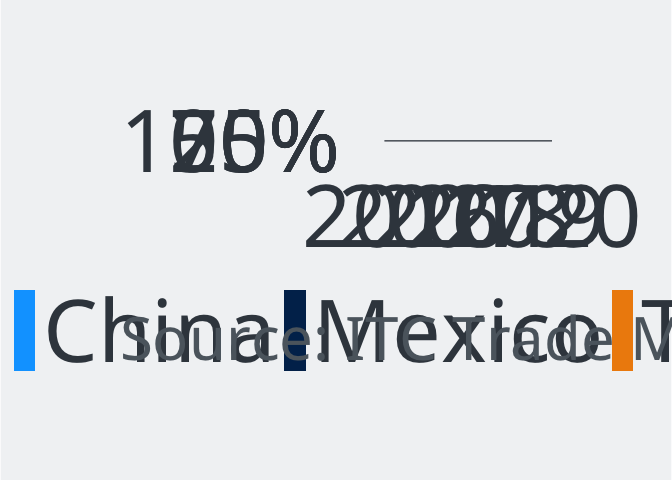
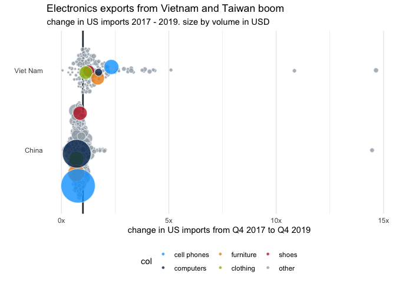

# The real winners of the US-China trade dispute

China and the US have been locked in a trade dispute for more than two
years. With prices for Chinese products rising, where do US consumers
and manufacturers import from instead? This DW analysis shows how global
trade flows have shifted, and how it’s changing the lives of those
affected

*Idea:* Analyze import redirection. If US consumers and manufacturers
have to pay more for Chinese products due to high tariffs, they might
choose to import from alternative countries instead. We analyze which
countries have seen a higher-than-expected rise in US import market
shares, and which specific products have been substituted.

This analysis broadly follows the methodology of the study on US-China
trade diversion from
[Nomura, 2019](https://www.nomuraconnects.com/focused-thinking-posts/us-china-trade-diversion-who-benefits/),
but looking at the timeframe from Q4 2017 (before the start of the trade
dispute) to Q4 2019 (after two years of trade dispute, but before the
Covid-19 pandemic). The analysis then looks at what has changed since
the pandemic started.

*In this repository, you will find the methodology, data and code behind
the story that came out of this analysis.*

**Read the full article on DW.com:** [English](https://www.dw.com/a-xxx)
| [German](https://www.dw.com/a-xxx)

**Story by:** [Kira Schacht](https://twitter.com/daten_drang), Christine
Laskowski

# Data sources

For this project, we’ll be using the following datasets:

  - Quarterly imports to the US and China by origin country and product
    (4-digit HS code level), Q3 2015 - Q2 2020, Source: [ITC Trade
    Map](https://www.trademap.org/)
  - Product codes tariffed in the US-China trade dispute, Source:
    [USTR](https://ustr.gov/issue-areas/enforcement/section-301-investigations/search)
  - Country names and corresponding ISO-3 country codes, Source: [World
    Trade
    Organization](https://docs.wto.org/gtd/Default.aspx?pagename=WTOIsocodes&langue=e)
  - Country codes with corresponding regions and continents, source: [UN
    Statistics Division](https://unstats.un.org/unsd/methodology/m49/)
  - GDP by country 2018, Source: [World Bank
    (NY.GDP.MKTP.CD)](https://data.worldbank.org/indicator/NY.GDP.MKTP.CD),
    data for Taiwan from [WTO Trade
    Profile](https://www.wto.org/english/res_e/statis_e/daily_update_e/trade_profiles/TW_e.pdf)

# Analysis

## 0\. Read data

countries included in this analysis:

  - 10 biggest economies per continent by gdp
  - 50 biggest economies globally by gdp
  - excluding Cuba, which didn’t import anything to the US in 2017

<!-- end list -->

    ## # A tibble: 67 x 4
    ## # Groups:   continent [5]
    ##    iso.code country      continent gdp18
    ##    <chr>    <chr>        <chr>     <dbl>
    ##  1 DZA      Algeria      Africa    174. 
    ##  2 AGO      Angola       Africa    101. 
    ##  3 EGY      Egypt        Africa    251. 
    ##  4 ETH      Ethiopia     Africa     84.3
    ##  5 GHA      Ghana        Africa     65.6
    ##  6 KEN      Kenya        Africa     87.8
    ##  7 MAR      Morocco      Africa    118. 
    ##  8 NGA      Nigeria      Africa    398. 
    ##  9 ZAF      South Africa Africa    368. 
    ## 10 TZA      Tanzania     Africa     58.0
    ## # ... with 57 more rows

Dataset overview:

`d_usa` imports to the USA from the 50 biggest economies (GDP) plus
Taiwan, by:

  - `p.code`: product codes (HS4)
  - `quarter`: quarter (Q3 2015 - Q2 2020)
  - `country`: import country
  - `value`: value in thousand USD

`d_usa_total` total imports to the USA by:

  - `p.code`: product code (HS4)
  - `quarter`: quarter (Q3 2015 - Q2 2020)
  - `value`: value in thousand USD

Equivalent for `d_china_total` and `d_china`.

`p` list of 4-digit product codes and descriptions:

  - `p.code`: product code (HS4)
  - `p.label`: official product description (HS4)
  - `p.code.clean`: consolidated product codes for use with this
    analysis
  - `short.name`: short product labels for use with this analysis

For this analysis, we have merged some product codes and given labels
where appropriate. A list of all labels and groupings can be found in
the file `product_names.tsv`.

`t` list of tariffed products by

  - `HTS_id`: product code (HS4)
  - `a_vol`: volume of the corresponding tariff action(s)
  - `a_name`: label of the corresponding tariff action(s) (Lists 1
    through 4)

`gdp` GDP 2018 by country, region and continent

## 1\. Overview of trade between US and China

### 1.1 How has trade between the US and China changed?

#### Total US import volume over time

<!-- -->

The total US trade volume decreased during the trade dispute, and even
more during the pandemic.

#### US imports from China vs China’s imports from the US

**in USD**
<!-- -->

**in percent (market share)**
<!-- -->

#### Decrease between 2017 and 2019

In 2017, the US imported products worth USD 0 bn from China. That was
around % of all US imports. By Q4 2019, China provided only % of US
imports. With the 2017 figures as a baseline, this decrease of % equals
a loss of around USD bn per year.

### 1.2 Who are the main importers to the US?

<!-- -->

### 1.3 What are the main US imports from China?

<!-- -->

<!-- -->

### 1.4 What share of Chinese products is tariffed?

for Q4 2019:

    ## # A tibble: 2 x 3
    ##   tariff     `Number of categories` `Import value`
    ##   <chr>                       <dbl>          <dbl>
    ## 1 Tariffed                   0.952          0.927 
    ## 2 Untariffed                 0.0481         0.0735

95% of products and 93% of US import value are subject to
tariffs.

## 2\. Change during Covid

### 2.1 Which product imports from China have risen the most from Q4 2019 to Q2 2020?

    ##    p.code                               short.name 2019-Q4 2020-Q2   change
    ## 1    6307                textiles incl. face masks  833817 8058771 9.664916
    ## 2    6210                   textiles including PPE  234748 1603510 6.830772
    ## 3    8415                         air conditioners  269501  885547 3.285876
    ## 4    2936                                 vitamins  142888  308208 2.156990
    ## 5    8424 spray machines (e.g. fire extinguishers)  228514  442546 1.936625
    ## 6    9018                      medical instruments  450047  819861 1.821723
    ## 7    7321                                   stoves  412257  743674 1.803909
    ## 8    8414                                air pumps  643019 1017658 1.582625
    ## 9    3926              plastics incl. face shields 1373511 2031869 1.479325
    ## 10   8433                    agricultural machines  129775  188321 1.451135

Many medical products have skyrocketed. The category of textiles that
includes face masks has increased almost ten-fold between Q4 2019 and Q2
2020.

### .2 Which product imports overall have risen the most from Q4 2019 to Q2 2020?

    ## # A tibble: 10 x 5
    ##    p.code short.name                         `2019-Q4` `2020-Q2` change
    ##    <chr>  <chr>                                  <dbl>     <dbl>  <dbl>
    ##  1 7115   "things made from precious metals"    781622  13618333  17.4 
    ##  2 6307   "textiles incl. face masks"          1225652   8938914   7.29
    ##  3 7108   "gold"                               3495674  18966629   5.43
    ##  4 6210   "textiles including PPE"              441978   2013990   4.56
    ##  5 0806   "grapes"                              164892    658832   4.00
    ##  6 3808   "insecticide"                         216429    607370   2.81
    ##  7 3003   "medicaments"                         106196    285867   2.69
    ##  8 9025   "thermometers o.\u00e4."              219135    581057   2.65
    ##  9 2932   "chemicals"                           361826    872049   2.41
    ## 10 7118   "coins"                               246449    551113   2.24

Some medical products, others seem to be seasonal.

## 3\. Trade redirection effects

To estimate the effect of trade redirection on different products, we’ll
look at how the market share of different countries in each product has
changed over time. We would expect that in products affected by tariffs,
China’s market share would drop, and other countries’ market shares
would rise instead.

The percentage point difference in market share of country c in the
import market for product p is described as:

or:

    (US imports of product p from country c in Q4 2019/US imports of product p in Q4 2019) -
    (US imports of product p from country c in Q4 2017/US imports of product p in Q4 2017) =
    
    US import market share of country c in product p in Q4 2019 -
    US import market share of country c in product p in Q4 2017

### 3.1 Estimate the loss of China’s market share in US imports

Which products have seen the largest drop in China’s market share within
US imports?

**China’s average market share decline in tariffed vs non-tariffed
products:**

    ## # A tibble: 2 x 2
    ##   tariff       change
    ##   <chr>         <dbl>
    ## 1 Tariffed   -0.0339 
    ## 2 Untariffed -0.00743

Imports of tariffed products fell by 3.4 percentage points on average,
while non-tariffed items fell by only 0.7 percentage points.

**Which imports to the US have been affected by import substitution away
from China?**

i.e. for which products has China’s market share dropped more than that
of non-tariffed products between Q4 2017 and Q4 2019?

    ## # A tibble: 2 x 5
    ##   subs      n value_19Q4 `Number of categories` `Import value`
    ##   <lgl> <int>      <dbl>                  <dbl>          <dbl>
    ## 1 FALSE   499       17.0                  0.433          0.159
    ## 2 TRUE    654       89.7                  0.567          0.841

Indication of import substitution can be found in 654 tariffed product
categories (57% of all product categories), making up 84% of tariffed US
import value in Q4 2019 (USD 89 bn).

Next, we calculate the *change in imports* for 654 tariffed products
with indication of import substitution. This is expressed as:

    change in imports of prouct p from country c =
        change in country c's share in US imports of product p * total US import value in Q4 2019

with the change in country c’s share in US imports of product p defined
as:

    (US imports of product p from country c in Q4 2019/US imports of product p in Q4 2019) -
    (US imports of product p from country c in Q4 2017/US imports of product p in Q4 2017) =
    
    US import market share of country c in product p in Q4 2019 -
    US import market share of country c in product p in Q4 2017

**Which products are most heavily impacted by the tariffs?**

Filter for products imported by China with the highest loss in imports.

    ## # A tibble: 10 x 8
    ##    p.code.clean short.name `2017-Q4` `2019-Q4`  change change.imports.~
    ##    <chr>        <chr>          <dbl>     <dbl>   <dbl>            <dbl>
    ##  1 847X         computers      0.617    0.445  -0.172            -5.18 
    ##  2 940X         furniture      0.468    0.329  -0.139            -1.72 
    ##  3 8517         cell phon~     0.713    0.662  -0.0514           -1.54 
    ##  4 6XXX         clothing       0.343    0.251  -0.0920           -1.18 
    ##  5 8523         storage m~     0.412    0.0694 -0.343            -1.09 
    ##  6 4202         bags           0.549    0.328  -0.221            -0.600
    ##  7 8528         monitors       0.466    0.369  -0.0966           -0.589
    ##  8 8541         <NA>           0.228    0.0773 -0.151            -0.527
    ##  9 64XX         shoes          0.525    0.444  -0.0807           -0.490
    ## 10 8504         electrica~     0.421    0.302  -0.119            -0.479
    ## # ... with 2 more variables: value_17Q4 <dbl>, value_19Q4 <dbl>

Exports of computers, furniture and cell phones from China to the US
have been most heavily affected by the tariffs. For example, China used
to provide 62% of imported US computers. In Q4 2019, it only provided
44%. That corresponds to a loss of around USD5bn over the two years of
the trade dispute.

### 3.2 Estimate additional imports to ths US from third party countries

Filter for products with the most additional imports:

    ## # A tibble: 10 x 9
    ##    country p.code.clean short.name `2017-Q4` `2019-Q4` change change.imports.~
    ##    <chr>   <chr>        <chr>          <dbl>     <dbl>  <dbl>            <dbl>
    ##  1 Viet N~ 8517         cell phon~    0.0367    0.102  0.0656            1.97 
    ##  2 Mexico  847X         computers     0.190     0.254  0.0640            1.93 
    ##  3 Taipei~ 847X         computers     0.0422    0.106  0.0634            1.91 
    ##  4 Russia~ 2710         petroleum     0.155     0.224  0.0692            1.03 
    ##  5 Viet N~ 940X         furniture     0.112     0.194  0.0819            1.02 
    ##  6 Malays~ 8542         electroni~    0.407     0.513  0.106             0.957
    ##  7 Ireland 2934         chemicals     0.181     0.523  0.342             0.618
    ##  8 Korea,~ 2710         petroleum     0.0469    0.0839 0.0370            0.553
    ##  9 Mexico  8528         monitors      0.429     0.514  0.0847            0.516
    ## 10 Canada  7115         things ma~    0.191     0.840  0.648             0.507
    ## # ... with 2 more variables: value_17Q4 <dbl>, value_19Q4 <dbl>

Cell phones from Vietnam, computers from Mexico and Taiwan have gained
the most.

#### sum by product

    ## # A tibble: 20 x 3
    ## # Groups:   p.code.clean [20]
    ##    p.code.clean short.name            change.imports.bn
    ##    <chr>        <chr>                             <dbl>
    ##  1 847X         computers                         5.19 
    ##  2 940X         furniture                         1.67 
    ##  3 8517         cell phones                       1.50 
    ##  4 8523         storage media                     1.11 
    ##  5 2710         petroleum                         1.00 
    ##  6 6XXX         clothing                          0.808
    ##  7 8528         monitors                          0.586
    ##  8 8541         <NA>                              0.502
    ##  9 8504         electrical converters             0.470
    ## 10 64XX         shoes                             0.427
    ## 11 8544         cables                            0.426
    ## 12 8443         printers                          0.407
    ## 13 8542         electronic circuits               0.376
    ## 14 8525         cameras                           0.376
    ## 15 4202         bags                              0.349
    ## 16 9504         gaming consoles                   0.340
    ## 17 4011         <NA>                              0.321
    ## 18 9404         bedding                           0.309
    ## 19 8708         car parts                         0.308
    ## 20 6810         <NA>                              0.246

Computers/computer parts (USD 5bn), furniture (USD 1.7bn) and cell
phones (USD 1.5bn) have gained the most overall.

#### sum by country

    ## # A tibble: 10 x 2
    ##    country            change.imports.bn
    ##    <chr>                          <dbl>
    ##  1 Viet Nam                       6.43 
    ##  2 Mexico                         4.66 
    ##  3 Taipei, Chinese                3.17 
    ##  4 Malaysia                       1.74 
    ##  5 India                          1.64 
    ##  6 Korea, Republic of             1.60 
    ##  7 Russian Federation             1.21 
    ##  8 Thailand                       1.04 
    ##  9 Ireland                        0.811
    ## 10 Italy                          0.681

Vietnam, Mexico and Taiwan have gained the most overall.

<!-- -->

#### scale by GDP

    ## # A tibble: 10 x 4
    ##    country         perc.gdp    gdp18 change.imports.bn
    ##    <chr>              <dbl>    <dbl>             <dbl>
    ##  1 Viet Nam           2.62   245.              6.43   
    ##  2 Taipei, Chinese    0.537  589.              3.17   
    ##  3 Malaysia           0.486  359.              1.74   
    ##  4 Mexico             0.382 1221.              4.66   
    ##  5 Fiji               0.364    5.54            0.0202 
    ##  6 Tonga              0.283    0.450           0.00128
    ##  7 Ireland            0.212  383.              0.811  
    ##  8 Thailand           0.206  507.              1.04   
    ##  9 Singapore          0.166  373.              0.620  
    ## 10 Egypt              0.134  251.              0.337

Relative to GDP, Vietnam has benefited the most. The added USD 6.4bn
equal 2.6% of the countrie’s 2018
GDP.

## 4\. Market share changes by country

### South-East Asia: Beneficiary countries who have kept their gains during the pandemic

<!-- -->

### Others: Beneficiary countries who have not kept their gains

<!-- -->

## 5\. Market share changes by product

### computers market share

<!-- -->

### bubble chart: import value changes by country and product

<!-- --><!-- -->

<!-- -->

<!-- -->
